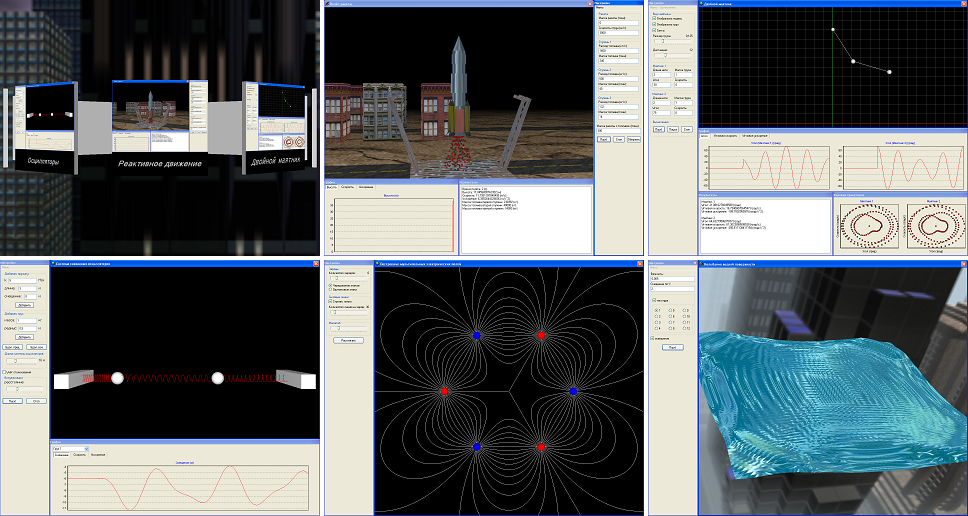
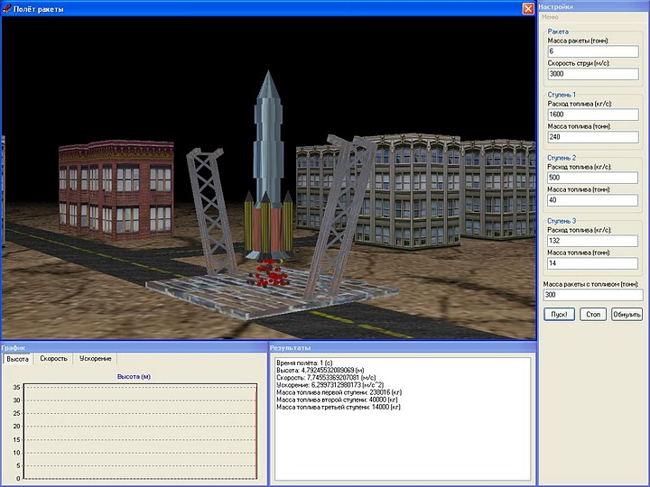

# MakarovPhysics

A collection of interactive simulations for visualizing various physical processes in real time.

The project focuses on combining numerical modeling with graphical representation to better understand dynamic systems.

## Overview

This application includes several simulation modules, such as:

- Rocket motion based on reactive propulsion principles  
- Oscillation systems (including pendulums and spring-based models)  
- Particle motion in electric fields  
- Fluid surface oscillations  

Each simulation is designed to demonstrate the underlying physical behavior through real-time visualization and user interaction.

## Technical Details

- Language: Delphi 12 (Community Edition), Win32 target  
- Graphics: OpenGL  
- Rendering: custom real-time rendering logic  
- Simulation: numerical approximation of physical systems  

The application uses custom implementations for both simulation logic and rendering, without relying on external physics or graphics engines.

## Architecture

The application is split into a launcher (`physic.exe`) and a set of independent
simulation modules built as DLLs under `data/modules`. A shared OpenGL helper
library (`data/engine/engine.dll`) and a small tools library
(`data/engine/MakarovTools.dll`) are loaded by the launcher and the modules at
run time. The launcher reads `data/engine/modules.cfg` to discover the modules
and presents them as a rotating 3D carousel. The carousel is driven by the mouse:
horizontal cursor position spins it, hovering highlights a module, and a click
loads that module's DLL and calls its exported `InitLibrary` entry point.

## Building

One-shot build (from a *RAD Studio Command Prompt*, or any prompt with the
Delphi MSBuild environment available):

```
build.bat
```

`build.bat` builds the project group (engine, tools, modules, launcher), builds
the texture packer, and runs it to produce `data/textures/skybox.dat` and
`data/textures/preview.dat`. After it finishes, `physic.exe` can be run from the
project root. The generated `.dat` packs are not stored in the repository; the
source `.bmp` textures under `data/textures/` are.

Manual build:

- Requires Embarcadero Delphi 12 (Community Edition is sufficient).
- Open `physic.groupproj` and build the whole group, or build individual
  `.dproj` projects.
- Target platform: Win32. This keeps the original `Extended` ABI used across the
  module/engine boundary and the legacy fixed-function OpenGL path.
- Build order: `engine` and `MakarovTools` first, then the modules, then
  `physic`. The project group is already arranged in this order.
- Output goes straight into the runtime layout: `physic.exe` in the root,
  `engine.dll` / `MakarovTools.dll` in `data/engine`, and each module DLL in
  `data/modules`.
- Pack the textures once with the `bmp2dat` tool (or just run `build.bat`):
  `bmp2dat data\textures\skybox 256 data\textures\skybox.dat` and
  `bmp2dat data\textures\preview 512 data\textures\preview.dat`.

## Modernization (Delphi 12 upgrade)

The original sources were written for Delphi 7 (2004–2011). The project has been
brought up to date for Delphi 12 without changing its structure or behavior:

- Added Delphi 12 `.dproj` / `.groupproj` project files; the legacy `.bdsproj`
  files are no longer used.
- Fixed Unicode-era issues in the launcher (string / `PChar` handling, an
  out-of-range module-name access, and a divide-by-zero in the rotation math).
- Replaced the path lookup that relied on `Application.GetNamePath` with the
  executable path.
- Converted the module timer callbacks to the correct `stdcall` `TIMERPROC`
  signature and replaced the deprecated `TThread.Resume` with `Start`.
- Removed stale precompiled units and legacy IDE artifacts and added a
  `.gitignore`.
- Translated all source comments, string literals and UI captions from Russian
  to English; the sources are now plain ASCII, which avoids code-page issues.
- Replaced the keyboard-driven menu carousel with mouse control (move to spin,
  hover to highlight, click to launch) using OpenGL selection-buffer picking.
- Replaced the skybox textures with a procedurally generated gradient sky
  (seamless, no third-party assets) to avoid any licensing uncertainty.

## Features

- Real-time simulation and rendering  
- Interactive parameter manipulation  
- Visualization of dynamic systems and physical processes  
- Modular structure with multiple independent simulation scenarios  

## Screenshots




## Purpose

This project was created as an experimental environment for exploring computer graphics and physics simulations, as well as for gaining hands-on experience with real-time rendering and visualization techniques.

## Notes

The project reflects practical experimentation with graphics and simulation concepts rather than production-level engineering.
